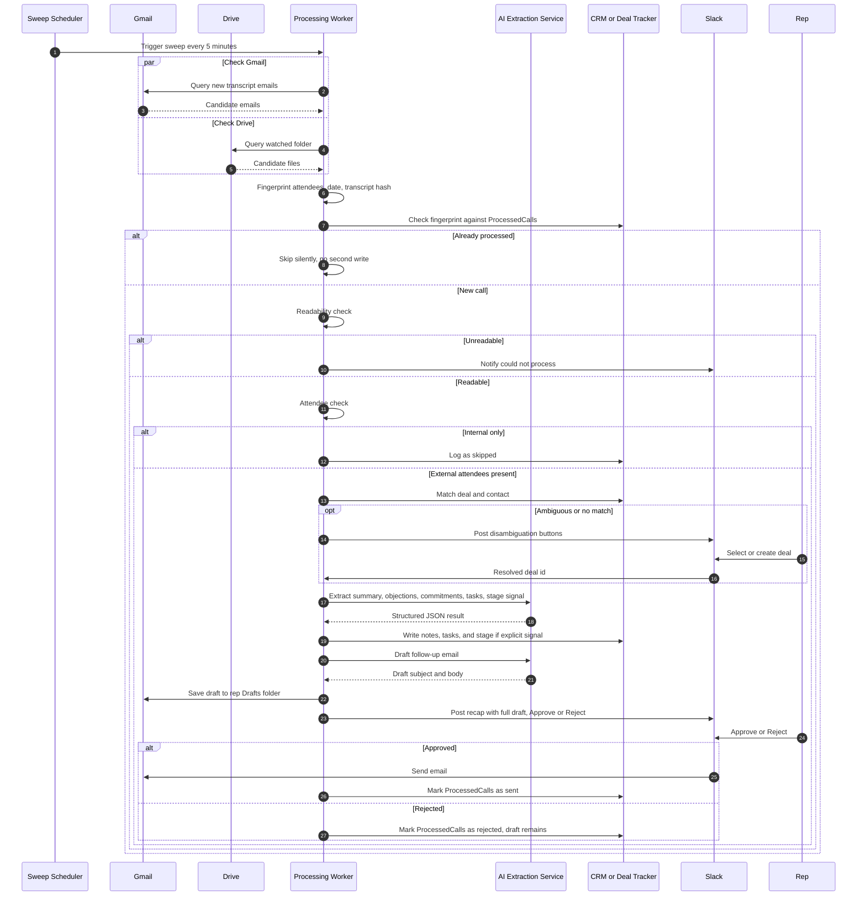
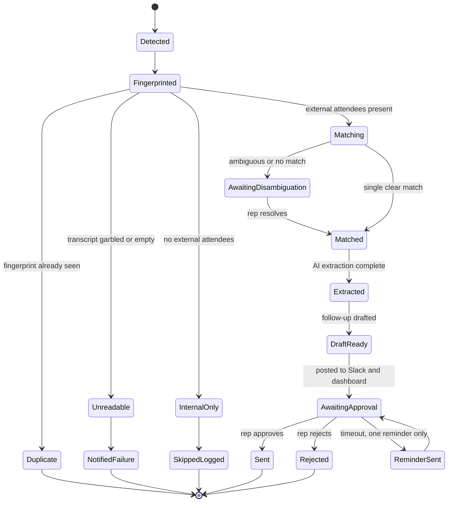
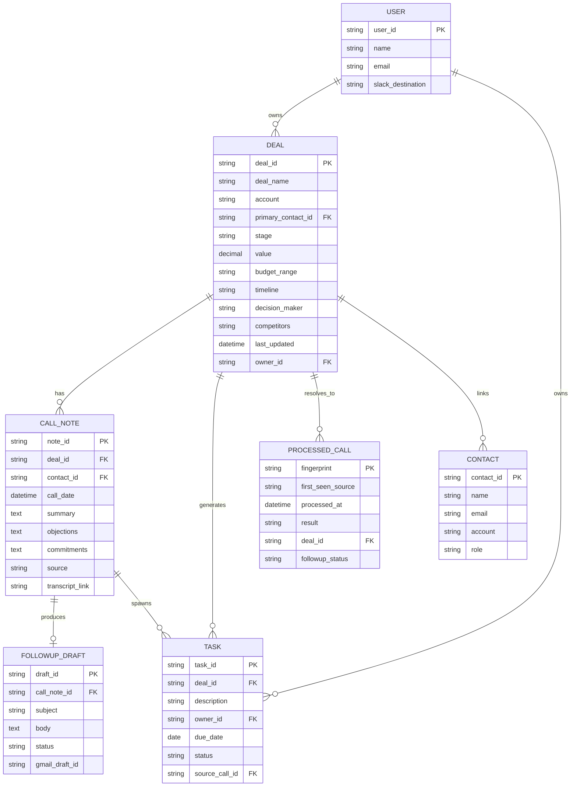

# CallForge — Gravity Sales Call Workspace

Gravity is a sales-call intelligence workspace: it watches the places a call transcript lands (email and Drive), extracts what was actually said into a deal update, dated tasks, and a follow-up draft, and puts every next step one tap from sending. The frontend is a live, real-time dashboard — Activity Feed, Pipeline, Call Notes, Tasks, Contacts, and Settings — backed by a REST API with SSE push updates, so everything displayed is wired end-to-end.

The repository also contains the CallForge HubSpot marketplace app scaffolding (`hubspot-app/`) and the design references (`stitch_dynamic_interface_studio/`).

---

## Table of contents

- [Features](#features)
- [Architecture](#architecture)
- [Agent processing pipeline](#agent-processing-pipeline)
- [Core workflow](#core-workflow)
- [Call & approval lifecycle](#call--approval-lifecycle)
- [Data model](#data-model)
- [Repository structure](#repository-structure)
- [Technology stack](#technology-stack)
- [Getting started](#getting-started)
- [Live demo workspace](#live-demo-workspace)
- [API surface](#api-surface)
- [Environment variables](#environment-variables)
- [Testing](#testing)
- [Production notes & security](#production-notes--security)
- [Related documents](#related-documents)

---

## Features

- **Live, real-time dashboard** — every screen reads from a shared server-side store (`lib/store.ts`) and updates instantly across open tabs via SSE (`/api/events`), with optimistic client updates.
- **Activity Feed** — live stats (calls logged, drafts sent, time saved), pending follow-up approvals (approve/reject), input-needed resolution, and a real-time event feed.
- **Simulated pipeline sweep** — the *Simulate incoming call* button runs the actual ingestion pipeline (fingerprint dedup → readability check → optional OpenAI extraction → call/draft/task writes) and pushes the result to every open tab.
- **Pipeline** — drag deals between stages, create deals, search and filter; column values recalculate live.
- **Tasks** — add, complete, and delete tasks with server-synced optimistic updates.
- **Call Detail + Follow-up Workspace** — edit a draft and save, approve & send, reject, expand the transcript, resolve missing input, with proper not-found handling.
- **Settings & Contacts** — live integration toggles, workspace configuration, and a contact list.
- **Responsive UI** — desktop nav, mobile hamburger menu, and breakpoint-tuned layouts on every page.

---

## Architecture

The product is a scheduled ingestion-and-extraction pipeline behind a conventional SaaS dashboard. A worker sweeps Gmail and Drive every five minutes, deduplicates transcripts by fingerprint, extracts structured facts with an LLM, and writes to the CRM — while the dashboard (this app) reads and writes the same data through a Core API.

```mermaid
flowchart LR
    subgraph Client["Client Layer"]
        WEB["Gravity Web App<br/>Next.js + React"]
        SLACKUI["Slack Approval Surface"]
    end

    subgraph Edge["API Edge"]
        GW["API Gateway<br/>REST + Auth"]
        RT["Realtime Gateway<br/>SSE"]
    end

    subgraph Services["Application Services"]
        API_SVC["Core API Service<br/>Deals, Contacts, Tasks, Drafts"]
        SCHED["Sweep Scheduler<br/>cron, every 5 min"]
        WORKER["Processing Worker"]
        AI_SVC["AI Extraction Service"]
        NOTIF["Notification Service"]
    end

    subgraph Data["Data Layer"]
        PG[("Primary DB<br/>Postgres")]
        QUEUE[[("Job Queue<br/>Redis / BullMQ")]]
        BLOB[("Object Storage<br/>links and attachments")]
    end

    subgraph External["External Integrations - OAuth"]
        GMAIL["Gmail API"]
        DRIVE["Drive API"]
        SLACKAPI["Slack API"]
        CRMAPI["CRM API<br/>HubSpot, etc."]
        SHEETAPI["Sheets API<br/>Deal Tracker fallback"]
        LLM["OpenAI API"]
    end

    WEB --> GW
    WEB --> RT
    SLACKUI --> SLACKAPI
    GW --> API_SVC
    RT --> API_SVC
    API_SVC --> PG
    API_SVC --> QUEUE
    API_SVC --> CRMAPI
    SCHED --> QUEUE
    QUEUE --> WORKER
    WORKER --> GMAIL
    WORKER --> DRIVE
    WORKER --> PG
    WORKER --> AI_SVC
    AI_SVC --> LLM
    WORKER --> NOTIF
    NOTIF --> SLACKAPI
    NOTIF --> GMAIL
    WORKER --> CRMAPI
    WORKER --> SHEETAPI
    WORKER --> BLOB
```

**Reading the diagram:**

- The **Client Layer** is what a rep touches: the Gravity web app for everything, and Slack for one-tap approvals and disambiguation.
- The **Core API Service** is a conventional CRUD/read API backing the dashboard. It never talks to Gmail, Drive, or an LLM directly — it reads/writes the data layer and enqueues work.
- The **Sweep Scheduler** is the only thing that starts a processing run, on a fixed cadence.
- The **Processing Worker** is where the core workflow actually executes and is the only component with write access to external systems, keeping the blast radius of extraction bugs contained.
- The **AI Extraction Service** is a thin, swappable wrapper around the LLM call so prompts and guardrails can change without touching worker control flow.

> **In this repository** the demo backend is an in-memory store on `globalThis` (see `lib/store.ts`) so the dashboard is fully interactive without external infrastructure; the Prisma schema (`prisma/schema.prisma`) is the production blueprint for the Postgres data layer.

---

## Agent processing pipeline

Each sweep runs the pipeline below. Every decision point maps to one owning component and one guardrail: a call seen by both email and Drive produces one write (fingerprint dedup), unreadable transcripts get a plain notice, internal-only calls create zero CRM noise, ambiguous deal matches go to a human, stages only move on an explicit signal, unstated due dates are written as "unspecified", and nothing client-facing sends without an explicit approve.

```mermaid
flowchart TB
    MT["Meeting Tool<br/>Zoom, Gong, Fireflies, Fathom, Otter"] -->|transcript email| GM["Gmail"]
    MT -->|transcript file| GD["Google Drive"]

    SCH([("5-minute Sweep")]) --> GMW["Gmail Watcher"]
    SCH --> GDW["Drive Watcher"]
    GM --> GMW
    GD --> GDW

    GMW --> FPR["Fingerprint and Dedup"]
    GDW --> FPR
    FPR --> PCDB[("ProcessedCalls Store")]

    FPR -->|new call| RC{"Readable?"}
    RC -->|no| FAIL["Notify: could not process"]
    RC -->|yes| ATC{"External attendees?"}

    ATC -->|internal only| SKIP["Log as skipped, no CRM write"]
    ATC -->|external present| DCM{"Deal match confidence"}

    DCM -->|clear match| EXT["AI Extraction Service"]
    DCM -->|ambiguous or none| SLKD["Slack / dashboard disambiguation"]
    SLKD -->|rep resolves| EXT

    EXT --> WRITE["Write notes, tasks, stage signal"]
    WRITE --> SOR[("CRM or Deal Tracker Sheet")]
    EXT --> DRAFT["Draft follow-up email"]

    DRAFT --> GDRAFT["Save to Gmail Drafts"]
    DRAFT --> RECAP["Slack + dashboard recap: full draft, Approve or Reject"]

    RECAP -->|approve| SEND["Send via Gmail"]
    RECAP -->|reject| STAY["Draft stays in Gmail"]
    SEND --> PCDB
    STAY --> PCDB
```

---

## Core workflow



Two details worth calling out:

- The `par` block is deliberate: Gmail and Drive are polled in parallel on every sweep, and whichever returns the transcript first is processed — the other arrival is later recognized by fingerprint and suppressed, never reprocessed.
- Disambiguation is the only place a human is in the loop *before* a CRM write. Every other human touchpoint (the final approval) happens *after* the internal work is already done and sitting ready.

---

## Call & approval lifecycle



`AwaitingApproval` can loop back to itself exactly once via `ReminderSent`; a second timeout is never auto-approved — it simply sits pending indefinitely. No code path sends without a tap.

---

## Data model



`PROCESSED_CALL` sits outside the "system of record" boundary — it is Gravity's own memory (the dedup/state ledger) regardless of where the deal itself lives, and it is the single mechanism that turns a re-run of the same sweep window into a no-op instead of a duplicate. The canonical Prisma schema lives in `prisma/schema.prisma`.

---

## Repository structure

```text
.
├── app/                            # Next.js App Router — pages + API routes
│   ├── activity/page.tsx           # Activity Feed (live stats, approvals, events)
│   ├── pipeline/page.tsx           # Pipeline kanban (drag-and-drop, create deal)
│   ├── tasks/page.tsx              # Daily Focus (tasks)
│   ├── contacts/page.tsx           # Contacts
│   ├── settings/page.tsx           # Settings & integrations
│   ├── calls/[callId]/page.tsx     # Call Detail + Follow-up Workspace
│   ├── api/
│   │   ├── state/route.ts          # GET full live snapshot
│   │   ├── events/route.ts         # SSE real-time stream
│   │   ├── deals/...               # POST create, PATCH stage/fields
│   │   ├── tasks/...               # POST create, PATCH, DELETE
│   │   ├── drafts/[id]/...         # PATCH edit, POST approve, POST reject
│   │   ├── calls/[id]/route.ts     # PATCH resolve missing input
│   │   ├── integrations/[provider]/route.ts  # POST connect/disconnect
│   │   ├── config/route.ts         # PATCH workspace config
│   │   └── demo/sweep/route.ts     # Simulated end-to-end pipeline sweep
│   ├── layout.tsx / globals.css    # Root layout + design system
├── components/                     # Client components
│   ├── app-shell.tsx               # Nav, notifications, help, mobile menu, toasts
│   ├── activity.tsx                # Live activity feed
│   ├── modal.tsx / toast.tsx       # Shared UI primitives
├── lib/
│   ├── store.ts                    # Server-side live store (single source of truth)
│   ├── live.ts                     # Client live store (useLive, SSE, mutations, toasts)
│   ├── demo-data.ts                # Seed data + canned transcripts
│   ├── types.ts                    # Shared domain types
│   ├── api.ts / format.ts          # Route helpers, formatting
│   └── store.test.ts               # Unit tests for the store
├── worker/                         # Ingestion pipeline (runs independently)
│   └── src/
│       ├── pipeline.ts             # Fingerprint, readability, OpenAI extraction
│       ├── contracts.ts            # Zod extraction schema
│       └── index.ts                # Worker entry point
├── prisma/schema.prisma            # Production Postgres schema
├── hubspot-app/callforge/          # CallForge HubSpot marketplace app
├── stitch_dynamic_interface_studio/# Design references (HTML prototypes)
├── gravity-technical-architecture-document.md
├── sales-call-logger-followup-drafter-prd.md
├── OAUTH_CREDENTIALS_SETUP.md
├── .env.example
└── package.json
```

---

## Technology stack

| Layer | Choice |
|---|---|
| Frontend | Next.js (App Router) + React 19 + TypeScript |
| Styling | Hand-rolled design system (`app/globals.css`), Material Symbols Outlined icons |
| Backend API | Next.js route handlers backed by an in-memory live store |
| Realtime | Server-Sent Events (`/api/events`) + 4s polling fallback |
| Worker | `tsx`-run pipeline (`worker/src/pipeline.ts`), OpenAI extraction, Zod validation |
| Database (production) | PostgreSQL via Prisma (`prisma/schema.prisma`) |
| Testing | Vitest (`lib/store.test.ts`) |

---

## Getting started

> **Windows note:** this repository lives in a folder path that can contain `&` and spaces, which breaks npm's `.cmd` shims. All npm scripts invoke `node` directly to avoid that. Use the npm scripts below rather than bare binaries like `npx vitest`.

1. **Install dependencies**

   ```bash
   npm install
   ```

2. **Configure environment**

   Copy `.env.example` to `.env` and fill in real values. `.env` is gitignored — never commit real secrets.

   ```bash
   cp .env.example .env
   ```

3. **Run the dev server**

   ```bash
   npm run dev
   ```

   Open `http://localhost:3000`. You land on the Activity Feed; use the *Simulate incoming call* button to watch the pipeline run live.

4. **Other scripts**

   | Command | What it does |
   |---|---|
   | `npm run dev` | Start the Next.js dev server |
   | `npm run build` | Production build (includes type checking) |
   | `npm run start` | Serve the production build |
   | `npm run lint` | TypeScript typecheck (`tsc --noEmit`) |
   | `npm test` | Run the Vitest suite |
   | `npm run worker` | Run the ingestion worker (demo mode) |

---

## Live demo workspace

The default interface is a visibly labelled **Demo Workspace** — it uses no customer data and needs no OAuth, Postgres, or OpenAI credentials to run. It is fully interactive and real-time:

- **Single source of truth** — `lib/store.ts` holds all state (deals, calls, drafts, tasks, integrations, config, event log, stats). Every API route reads/writes this store, and the store lives on `globalThis` so every Next.js dev bundle and HMR reload shares one database.
- **Real-time push** — any mutation bumps a version counter and notifies SSE subscribers; every open tab refreshes instantly. A 4s polling fallback keeps things consistent if the stream drops.
- **End-to-end pipeline demo** — *Simulate incoming call* (`POST /api/demo/sweep`) runs the real worker pipeline (fingerprint dedup → readability check → optional real OpenAI extraction when `OPENAI_API_KEY` is set, else a grounded canned extraction) and creates a call, a follow-up draft, and tasks that appear across Activity, Pipeline, Tasks, and Call Detail.
- **Optimistic UI** — checkboxes and other fast interactions update instantly and reconcile with the server.

---

## API surface

| Method | Path | Purpose |
|---|---|---|
| `GET` | `/api/state` | Full live snapshot (deals, calls, drafts, tasks, integrations, config, events, stats, version) |
| `GET` | `/api/events` | SSE stream — pushes a version bump on every store change |
| `POST` | `/api/deals` | Create a deal |
| `PATCH` | `/api/deals/:id` | Move stage or update fields |
| `POST` | `/api/tasks` | Create a task |
| `PATCH` | `/api/tasks/:id` | Complete / update a task |
| `DELETE` | `/api/tasks/:id` | Remove a task |
| `PATCH` | `/api/drafts/:id` | Edit draft (body, subject, recipient) |
| `POST` | `/api/drafts/:id/approve` | Approve & send (idempotent) |
| `POST` | `/api/drafts/:id/reject` | Reject (Gmail copy preserved) |
| `PATCH` | `/api/calls/:id` | Resolve missing input for a call |
| `POST` | `/api/integrations/:provider` | Connect / disconnect an integration |
| `PATCH` | `/api/config` | Update workspace setup |
| `POST` | `/api/demo/sweep` | Run a simulated pipeline sweep |
| `GET` | `/api/activity` | Activity feed payload (backward compatible) |

---

## Environment variables

See `.env.example` for the full template:

| Variable | Required for | Notes |
|---|---|---|
| `DATABASE_URL` | Production Postgres (Prisma) | Not needed for the in-memory demo |
| `OPENAI_API_KEY` | Live LLM extraction | Without it, the demo sweep uses grounded canned extraction |
| `OPENAI_MODEL` | Live LLM extraction | Default `gpt-4.1-mini` |
| `GOOGLE_CLIENT_ID` / `GOOGLE_CLIENT_SECRET` | Gmail/Drive/Sheets OAuth | See `OAUTH_CREDENTIALS_SETUP.md` |
| `SLACK_CLIENT_ID` / `SLACK_CLIENT_SECRET` | Slack recap/approvals | See `OAUTH_CREDENTIALS_SETUP.md` |
| `HUBSPOT_CLIENT_ID` / `HUBSPOT_CLIENT_SECRET` | HubSpot CRM | See `OAUTH_CREDENTIALS_SETUP.md` |
| `TOKEN_ENCRYPTION_KEY` | OAuth token encryption | 32-byte base64 key |
| `CRON_SECRET` | Sweep scheduler auth | Random secret |

---

## Testing

```bash
npm test
```

The suite (`lib/store.test.ts`) covers seed consistency, draft update/approve/reject (including approve idempotency), deal stage moves and validation, task lifecycle, integration toggles, config merges, call input resolution, stats accounting, and subscriber notifications.

---

## Production notes & security

- The **Prisma schema is the system of record** and scopes all data by workspace (`prisma/schema.prisma`). The in-memory demo store is single-process; swap it for the Prisma-backed models for persistent, multi-instance production.
- **OAuth token encryption**, Gmail/Drive/Slack/HubSpot transport adapters, queue infrastructure, and signed Slack request verification must be configured with production secrets before deployment — never place those values in source control.
- The worker (`worker/src/pipeline.ts`) contains the deterministic transcript guardrails and validated OpenAI extraction. No code path in this design sends a client-facing email without an explicit approval.
- **Credential hygiene:** `.env` is gitignored; `.env.example` must only ever contain placeholders.

---

## Related documents

- [`gravity-technical-architecture-document.md`](./gravity-technical-architecture-document.md) — full technical architecture
- [`sales-call-logger-followup-drafter-prd.md`](./sales-call-logger-followup-drafter-prd.md) — product requirements
- [`OAUTH_CREDENTIALS_SETUP.md`](./OAUTH_CREDENTIALS_SETUP.md) — registering Google/Slack/HubSpot credentials
- [`hubspot-app/callforge/`](./hubspot-app/callforge/) — CallForge HubSpot marketplace app
