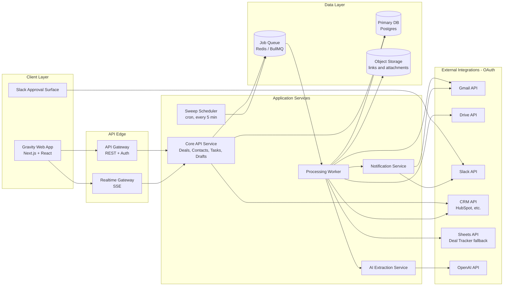
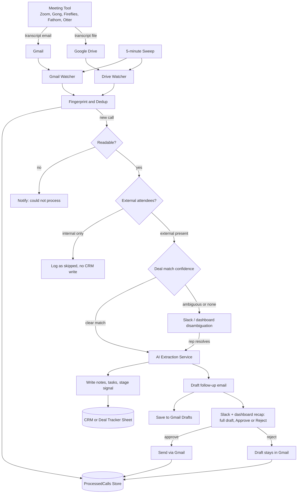
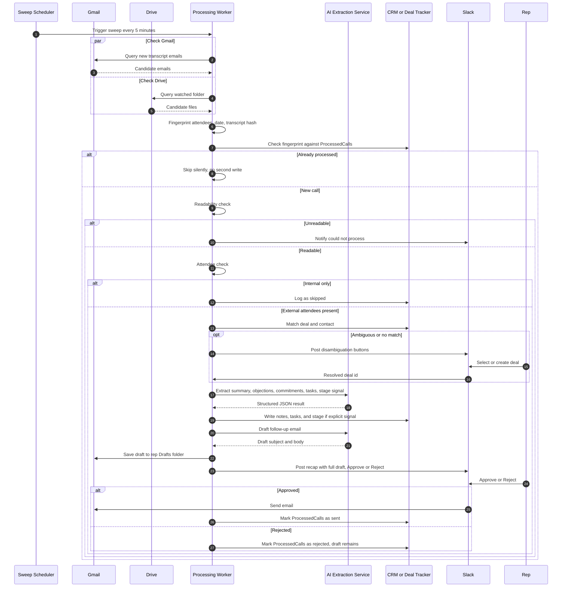
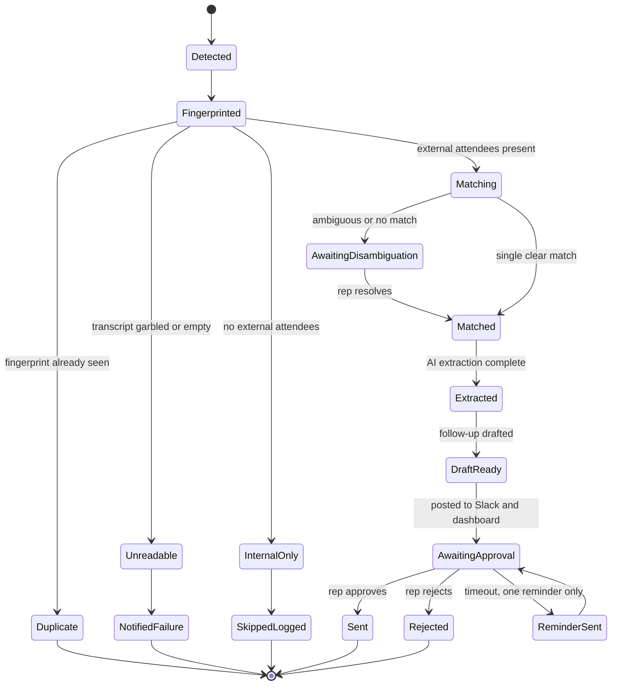
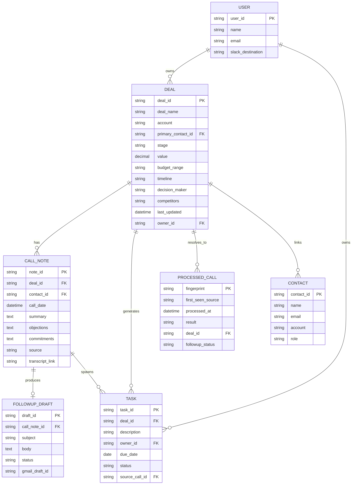

<div align="center">

# CallForge — Gravity Sales Call Workspace

**The silent sales partner.** Watch a call transcript land, and minutes later the CRM is updated, every objection and commitment is captured verbatim, tasks are owned and dated, and a grounded follow-up draft sits one tap from sending.


*Fully interactive demo workspace · no external credentials required · every screen wired end-to-end · real-time across open tabs*

</div>

---

## Why Gravity

Sales reps don't lose deals to competitors as often as they lose them to their own admin backlog. The CRM doesn't get updated, the details of a call live only in memory, and the follow-up goes out — if it goes out — after the client has moved on.

Gravity removes that tax by watching the two places a call transcript already lands — the transcript email and the Drive export — and turning whichever arrives first into:

- **A logged deal update** with every objection and commitment recorded verbatim, never softened
- **Owned, dated tasks** — or an explicit "unspecified" when the call never stated a date
- **A grounded follow-up draft** written from the specific things that were said, not a template

Everything internal happens without a click. The one thing that reaches the client — the follow-up email — waits for a single tap. No code path sends without an explicit approval.

The dashboard is a **fully interactive, real-time workspace**: every screen reads from a shared server-side store, every action flows through the API, and updates push to every open tab instantly over Server-Sent Events.

---

## Key features

| | |
|---|---|
| **Real-time everything** | A shared live store (`lib/store.ts`) feeds every screen. Approve a draft, drag a deal, complete a task — the change persists through the API and pushes to all open tabs via SSE. |
| **End-to-end pipeline demo** | *Simulate incoming call* runs the real ingestion pipeline — fingerprint dedup, readability check, optional OpenAI extraction — and creates a call, follow-up draft, and tasks that appear everywhere instantly. |
| **Human-gated follow-ups** | Drafts are grounded in the transcript and require explicit approval. Reject preserves the Gmail copy for editing. Approve is idempotent — no double-sends. |
| **Pipeline as a visual** | Deals are a drag-and-drop kanban with live stage/value sums, search, filters, and one-click deal creation. |
| **Guardrail-first AI** | Extraction only records facts supported by the transcript. Stages move only on explicit signals; unstated due dates are "unspecified", never invented. |
| **Responsive UI** | Desktop nav, mobile hamburger menu, and breakpoint-tuned layouts on every page. |
| **Secrets-safe by default** | `.env` is gitignored, `.env.example` holds placeholders only, and no credential ever ships in source control. |

---

## Real-time data flow

Every screen renders the same live snapshot served by the backend, so what you see is exactly what the API holds:

1. **One source of truth** — `lib/store.ts` holds all state (deals, calls, drafts, tasks, integrations, config, event log, stats) in a `globalThis` singleton, so every API route handler and every dev-mode HMR reload reads and writes the same database.
2. **Mutations go through the API** — create/move a deal, approve or reject a draft, resolve missing input, toggle an integration: each action hits a REST endpoint that validates, mutates the store, and bumps a monotonically increasing `version` counter.
3. **Push updates** — `/api/events` is a Server-Sent Events stream; on every version bump it notifies all connected clients, which refetch `/api/state` and re-render. A 4-second polling fallback keeps tabs in sync if the stream drops.
4. **Optimistic UI** — fast interactions (e.g., task checkboxes) update the view instantly and then reconcile with the server's response, reverting on failure.
5. **Verified end-to-end outcomes** — the behavior below is exercised by the test suite and the running app:
   - A pipeline sweep (`POST /api/demo/sweep`) runs fingerprint dedup → readability check → extraction → writes, producing one new call, one `awaiting_approval` follow-up draft, and its tasks, and increments the `callsLogged` stat.
   - Approving a draft transitions it to `sent`, increments `draftsSent` exactly once (the endpoint is idempotent), and appends a `Follow-up sent` event to the feed.
   - Dragging a deal between pipeline stages persists the new stage through the API, and column value sums recalculate from the live snapshot.

---

## Architecture

The product is a scheduled ingestion-and-extraction pipeline behind a conventional SaaS dashboard. A worker sweeps Gmail and Drive on a fixed cadence, deduplicates transcripts by fingerprint, extracts structured facts with an LLM, and writes to the CRM — while the dashboard reads and writes the same data through a Core API.



**Reading the diagram:**

- The **Client Layer** is what a rep touches: the Gravity web app for everything, and Slack for one-tap approvals and disambiguation.
- The **Core API Service** is a conventional CRUD/read API backing the dashboard. It never talks to Gmail, Drive, or an LLM directly — it reads/writes the data layer and enqueues work.
- The **Sweep Scheduler** is the only thing that starts a processing run, on a fixed cadence.
- The **Processing Worker** is where the core workflow actually executes and is the only component with write access to external systems, keeping the blast radius of extraction bugs contained.
- The **AI Extraction Service** is a thin, swappable wrapper around the LLM call so prompts and guardrails can change without touching worker control flow.

> **In this repository** the demo backend is an in-memory store on `globalThis` (see `lib/store.ts`) so the dashboard is fully interactive without external infrastructure; the Prisma schema (`prisma/schema.prisma`) is the production blueprint for the Postgres data layer.

---

## Agent processing pipeline

Each sweep runs the pipeline below. Every decision point maps to one owning component and one guardrail: a call seen by both email and Drive produces one write (fingerprint dedup), unreadable transcripts get a plain notice, internal-only calls create zero CRM noise, ambiguous deal matches go to a human, stages only move on an explicit signal, unstated due dates are written as "unspecified", and nothing client-facing sends without an explicit approve.



### Guardrails at a glance

| Stage | Guardrail it enforces |
|---|---|
| Fingerprint & dedup | A call seen by both email and Drive produces one write, not two |
| Readability classifier | An unreadable transcript gets a plain notice, never a silent drop |
| Attendee classifier | Internal-only calls generate zero CRM noise |
| Deal & contact matcher | Ambiguous matches go to a human; the system never guesses |
| Stage signal detector | The stage only moves on an explicit, quotable line in the transcript |
| Task generator | An unstated due date is written as "unspecified", never invented |
| Draft + recap | Nothing client-facing sends without an explicit approve |

---

## Core workflow



Two details worth calling out:

- The `par` block is deliberate: Gmail and Drive are polled in parallel on every sweep, and whichever returns the transcript first is processed — the other arrival is later recognized by fingerprint and suppressed, never reprocessed.
- Disambiguation is the only place a human is in the loop *before* a CRM write. Every other human touchpoint (the final approval) happens *after* the internal work is already done and sitting ready.

---

## Call & approval lifecycle



`AwaitingApproval` can loop back to itself exactly once via `ReminderSent`; a second timeout is never auto-approved — it simply sits pending indefinitely. No code path sends without a tap.

---

## Data model



`PROCESSED_CALL` sits outside the "system of record" boundary — it is Gravity's own memory (the dedup/state ledger) regardless of where the deal itself lives, and it is the single mechanism that turns a re-run of the same sweep window into a no-op instead of a duplicate. The canonical Prisma schema lives in [`prisma/schema.prisma`](./prisma/schema.prisma).

---

## Repository structure

```text
.
├── app/                            # Next.js App Router — pages + API routes
│   ├── activity/page.tsx           # Activity Feed (live stats, approvals, events)
│   ├── pipeline/page.tsx           # Pipeline kanban (drag-and-drop, create deal)
│   ├── tasks/page.tsx              # Daily Focus (tasks)
│   ├── contacts/page.tsx           # Contacts
│   ├── settings/page.tsx           # Settings & integrations
│   ├── calls/[callId]/page.tsx     # Call Detail + Follow-up Workspace
│   ├── not-found.tsx               # Branded 404 page
│   ├── icon.svg                    # Favicon (brand mark)
│   ├── api/
│   │   ├── state/route.ts          # GET full live snapshot
│   │   ├── events/route.ts         # SSE real-time stream
│   │   ├── deals/...               # POST create, PATCH stage/fields
│   │   ├── tasks/...               # POST create, PATCH, DELETE
│   │   ├── drafts/[id]/...         # PATCH edit, POST approve, POST reject
│   │   ├── calls/[id]/route.ts     # PATCH resolve missing input
│   │   ├── integrations/[provider]/route.ts  # POST connect/disconnect
│   │   ├── config/route.ts         # PATCH workspace config
│   │   └── demo/sweep/route.ts     # Simulated end-to-end pipeline sweep
│   ├── layout.tsx / globals.css    # Root layout + design system
├── components/                     # Client components
│   ├── app-shell.tsx               # Nav, notifications, help, mobile menu, toasts
│   ├── activity.tsx                # Live activity feed
│   ├── modal.tsx / toast.tsx       # Shared UI primitives
├── lib/
│   ├── store.ts                    # Server-side live store (single source of truth)
│   ├── live.ts                     # Client live store (useLive, SSE, mutations, toasts)
│   ├── demo-data.ts                # Seed data + canned transcripts
│   ├── types.ts                    # Shared domain types
│   ├── api.ts / format.ts          # Route helpers, formatting
│   └── store.test.ts               # Unit tests for the store
├── worker/                         # Ingestion pipeline (runs independently)
│   └── src/
│       ├── pipeline.ts             # Fingerprint, readability, OpenAI extraction
│       ├── contracts.ts            # Zod extraction schema
│       └── index.ts                # Worker entry point
├── prisma/schema.prisma            # Production Postgres schema
├── hubspot-app/callforge/          # CallForge HubSpot marketplace app
├── stitch_dynamic_interface_studio/# Design references (HTML prototypes + screens)
├── gravity-technical-architecture-document.md
├── sales-call-logger-followup-drafter-prd.md
├── OAUTH_CREDENTIALS_SETUP.md
├── .env.example
└── package.json
```

---

## Technology stack

| Layer | Choice | Why |
|---|---|---|
| Frontend | Next.js (App Router) + React 19 + TypeScript | Tabbed, per-record navigation fits App Router; strict typing keeps the data model honest |
| Styling | Hand-rolled design system (`app/globals.css`) | Sharp, low-noise components; Material Symbols Outlined icons; responsive breakpoints |
| Backend API | Next.js route handlers + in-memory live store | Zero-infrastructure demo that behaves like a real backend: persist, validate, notify |
| Realtime | Server-Sent Events (`/api/events`) + 4s polling fallback | Push updates to every open tab; polling keeps state consistent if the stream drops |
| Extraction | OpenAI (`worker/src/pipeline.ts`), Zod validation | Structured, schema-validated JSON — guardrails enforceable in code, not just prompts |
| Database (production) | PostgreSQL via Prisma | Relational by nature — deals have contacts, calls have tasks; one store, one schema |
| Testing | Vitest | Fast unit tests for the store's invariants (idempotency, validation, eventing) |

---

## Getting started

### Prerequisites

- **Node.js 18+** (developed against Node 24)
- **npm**

> **Windows note:** this repository lives in a folder path that can contain `&` and spaces, which breaks npm's `.cmd` shims. All npm scripts invoke `node` directly to avoid that. Use the npm scripts below rather than bare binaries like `npx vitest`.

### 1. Install dependencies

```bash
npm install
```

### 2. Configure environment

Copy `.env.example` to `.env` and fill in real values. `.env` is gitignored — never commit real secrets.

```bash
cp .env.example .env
```

For the **demo workspace you need nothing else** — the in-memory store runs without any environment variables. Live LLM extraction and external integrations only engage when their credentials are present.

### 3. Run the dev server

```bash
npm run dev
```

Open `http://localhost:3000`. You land on the Activity Feed; use the *Simulate incoming call* button to watch the pipeline run live.

### Scripts

| Command | What it does |
|---|---|
| `npm run dev` | Start the Next.js dev server (hot reload) |
| `npm run build` | Production build (includes type checking) |
| `npm run start` | Serve the production build |
| `npm run lint` | TypeScript typecheck (`tsc --noEmit`) |
| `npm test` | Run the Vitest suite |
| `npm run worker` | Run the ingestion worker (demo mode) |

---

## API reference

### Core endpoints

| Method | Path | Purpose |
|---|---|---|
| `GET` | `/api/state` | Full live snapshot (deals, calls, drafts, tasks, integrations, config, events, stats, version) |
| `GET` | `/api/events` | SSE stream — pushes a version bump on every store change |
| `POST` | `/api/deals` | Create a deal |
| `PATCH` | `/api/deals/:id` | Move stage or update fields |
| `POST` | `/api/tasks` | Create a task |
| `PATCH` | `/api/tasks/:id` | Complete / update a task |
| `DELETE` | `/api/tasks/:id` | Remove a task |
| `PATCH` | `/api/drafts/:id` | Edit draft (body, subject, recipient) |
| `POST` | `/api/drafts/:id/approve` | Approve & send (idempotent) |
| `POST` | `/api/drafts/:id/reject` | Reject (Gmail copy preserved) |
| `PATCH` | `/api/calls/:id` | Resolve missing input for a call |
| `POST` | `/api/integrations/:provider` | Connect / disconnect an integration |
| `PATCH` | `/api/config` | Update workspace setup |
| `POST` | `/api/demo/sweep` | Run a simulated pipeline sweep |
| `GET` | `/api/activity` | Activity feed payload (backward compatible) |

### Example — run the pipeline sweep

```bash
curl -X POST http://localhost:3000/api/demo/sweep
```

```json
{
  "duplicate": false,
  "call": { "id": "call_0a0f3452", "title": "TechFlow Architecture Review", "source": "Zoom", "dealId": "deal_techflow" },
  "draft": { "id": "draft_0a0f3452", "status": "awaiting_approval", "to": "nina.patel@techflow.io" },
  "fingerprint": "3f2c9d1e..."
}
```

### Example — approve a follow-up (idempotent)

```bash
curl -X POST http://localhost:3000/api/drafts/draft_acme/approve
```

A second approval returns the same draft without double-counting stats or re-sending.

### Example — real-time subscription

```bash
curl -N http://localhost:3000/api/events
```

```
data: {"version":1}

data: {"version":2}
```

Every mutation bumps `version`; clients refetch `/api/state` on each event.

---

## Testing

```bash
npm test
```

The suite (`lib/store.test.ts`) covers the store's invariants:

- **Seeding** — demo data is consistent (stats, events, entities)
- **Draft lifecycle** — edit persists; approve transitions and **increments stats exactly once** (idempotency asserted); reject transitions
- **Deals** — valid stage moves, invalid stages rejected, creation validation, event logging
- **Tasks** — create, complete, delete; required-field validation
- **Integrations & config** — toggles flip and log events; config merges without clobbering
- **Calls** — input resolution marks processed and records the answer; blank input rejected
- **Live notifications** — subscribers are notified on change and unsubscribable

---

## Worker & pipeline internals

`worker/src/pipeline.ts` contains the deterministic core:

- **`fingerprint(transcript)`** — SHA-256 of sorted attendees + call timestamp + transcript body. The same call arriving via email and Drive produces one write, not two.
- **`isReadable(body)`** — an unreadable (too-short/garbled) transcript is flagged, never silently dropped.
- **`isInternalOnly(attendees, domain)`** — internal-only calls log as skipped with zero CRM/Slack noise.
- **`extractTranscript(transcript)`** — calls the OpenAI model with a strict system prompt and validates the response against the Zod schema in `worker/src/contracts.ts` before anything is written.

The demo sweep (`POST /api/demo/sweep`) runs these functions end-to-end against canned transcripts, falling back to grounded canned extraction when `OPENAI_API_KEY` is not set — so the full flow is testable without credentials.

---

## Production notes & security

- The **Prisma schema is the system of record** and scopes all data by workspace (`prisma/schema.prisma`). The in-memory demo store is single-process; swap it for the Prisma-backed models for persistent, multi-instance production.
- **OAuth token encryption**, Gmail/Drive/Slack/HubSpot transport adapters, queue infrastructure, and signed Slack request verification must be configured with production secrets before deployment — never place those values in source control.
- **Credential hygiene:** `.env` is gitignored; `.env.example` must only ever contain placeholders. `.freebuff/`, `.next/`, and build artifacts are ignored too.
- **Idempotency by design:** the fingerprint uniqueness constraint and the idempotent approve endpoint mean re-runs never double-write and re-clicks never double-send.
- **Timeouts never escalate to auto-send.** A pending approval or disambiguation gets exactly one reminder; after that it simply sits — indefinitely if needed.

---

## Roadmap

- **In-app approval as the primary surface, Slack as a companion** — Slack and dashboard approvals reading/writing the same state (they already share the store today).
- **Editable-draft pattern** — if rejections mostly mean "let me tweak this", instrument for reject-reason and time-to-manual-send.
- **Native CRM task objects** where the connected CRM supports them, instead of only the internal `TASK` table.
- **Remembered deal-matching corrections** — a standing mapping so the same ambiguous match never resurfaces.
- **Production persistence** — swap the in-memory store for the Prisma/Postgres models with migrations and a seed script.

---

## Contributing

1. Fork the repository and create a feature branch.
2. Make changes and add tests for any store/API behavior you touch.
3. Run `npm test` and `npm run lint` (both are Windows-shim-safe).
4. Open a pull request describing the *why* — the guardrails above exist to keep the pipeline honest.

---

## Related documents

- [`gravity-technical-architecture-document.md`](./gravity-technical-architecture-document.md) — the full technical architecture (this README's diagrams are drawn from it)
- [`sales-call-logger-followup-drafter-prd.md`](./sales-call-logger-followup-drafter-prd.md) — product requirements & guardrail definitions
- [`OAUTH_CREDENTIALS_SETUP.md`](./OAUTH_CREDENTIALS_SETUP.md) — registering Google, Slack, and HubSpot credentials
- [`stitch_dynamic_interface_studio/`](./stitch_dynamic_interface_studio/) — design system (`gravity/DESIGN.md`) and HTML prototypes
- [`hubspot-app/callforge/`](./hubspot-app/callforge/) — the CallForge HubSpot marketplace app
