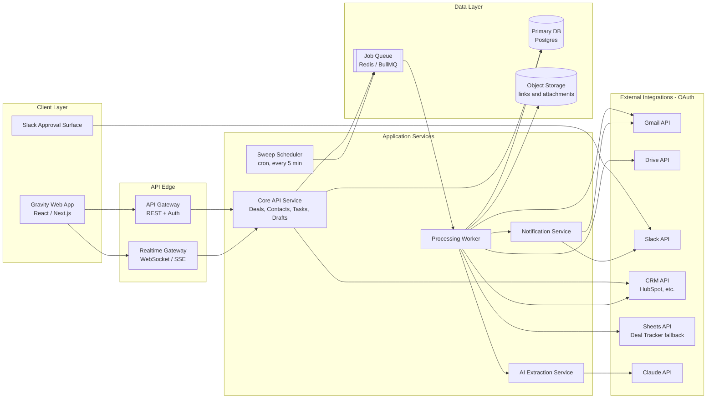
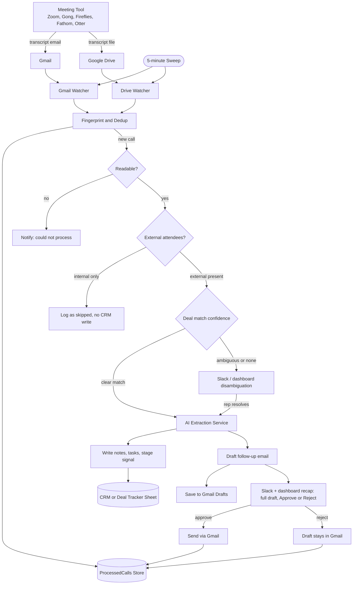
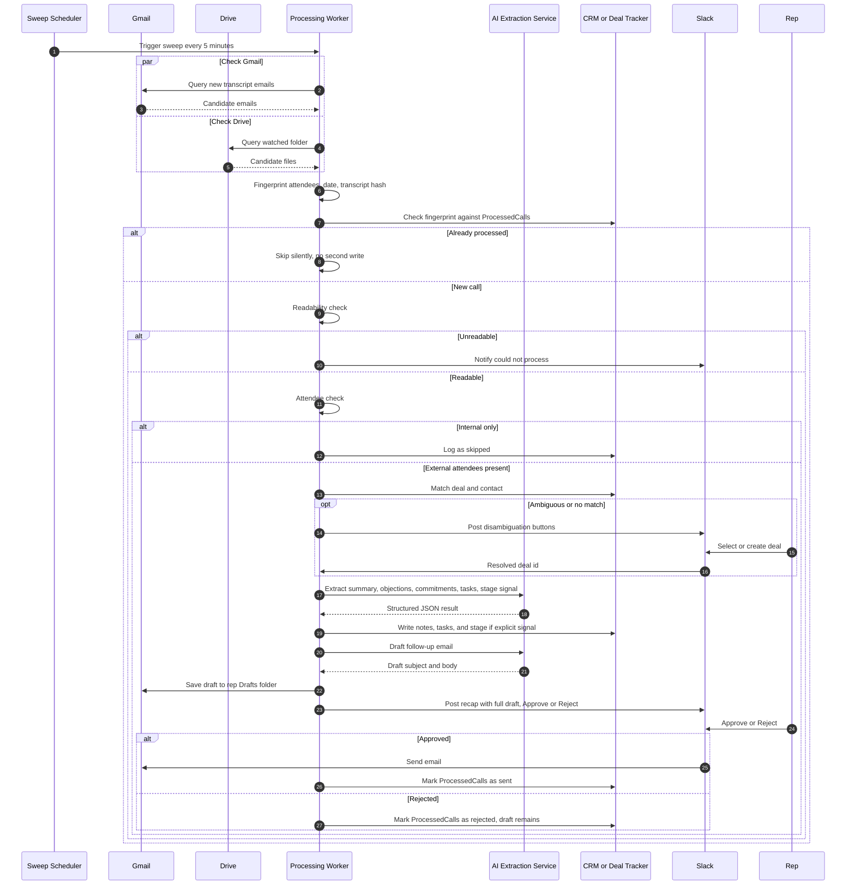
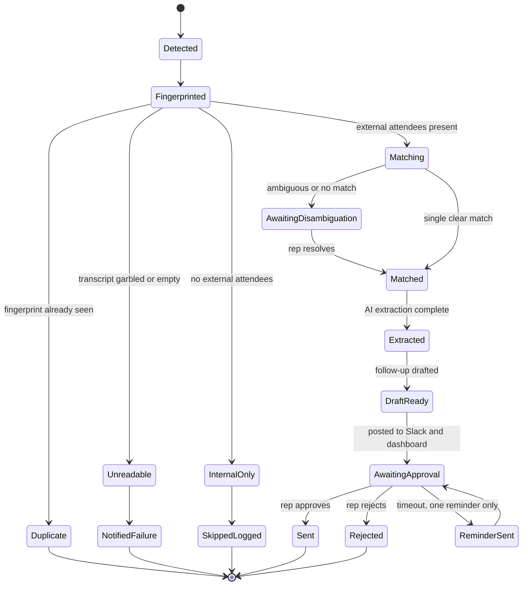
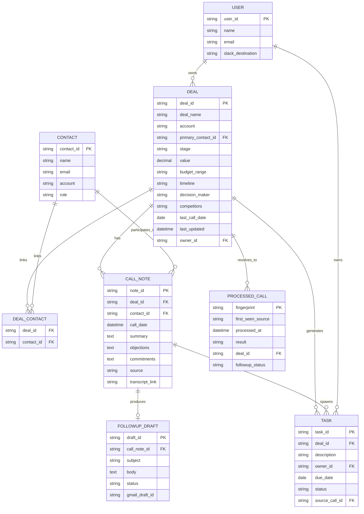

# Gravity — Technical Architecture Document
### Sales Call Logger & Follow-up Drafter

**Version:** 1.0 &nbsp;·&nbsp; **Status:** Draft for Engineering Review &nbsp;·&nbsp; **Date:** August 9, 2026
**Companion to:** PRD *"Sales Call Logger & Follow-up Drafter"* (v1.0) · Gravity Design System (`DESIGN.md`) · UI prototype set (4 product screens + Daily Focus HTML build)

| | |
|---|---|
| **Product** | Gravity — Sales Call Logger & Follow-up Drafter |
| **Architecture style** | Scheduled ingestion-and-extraction pipeline behind a conventional SaaS dashboard |
| **Core cadence** | 5-minute sweep; CRM and Slack/dashboard updates within minutes |
| **System of record** | Connected CRM (HubSpot-first) or a self-provisioned Deal Tracker sheet |
| **Approval surfaces** | Slack (primary today) + native in-app Pending Approvals (growing, per roadmap) |
| **AI's role** | Structured extraction and drafting only — never writes or sends on an unstated signal |
| **Primary safeguards** | Fingerprint dedup, explicit-signal-only stage moves, human-gated sends |

---

## Contents

1. [Document Purpose, Sources & Assumptions](#1-document-purpose-sources--assumptions)
2. [Executive Summary](#2-executive-summary)
3. [Product Overview](#3-product-overview)
4. [System Architecture](#4-system-architecture)
5. [Agent Processing Pipeline](#5-agent-processing-pipeline)
6. [Core Workflow — Sequence Diagram](#6-core-workflow--sequence-diagram)
7. [Call & Approval Lifecycle — State Model](#7-call--approval-lifecycle--state-model)
8. [Data Architecture](#8-data-architecture)
9. [AI Extraction Service & Guardrails](#9-ai-extraction-service--guardrails)
10. [Approval & Notification Layer](#10-approval--notification-layer)
11. [Frontend Architecture](#11-frontend-architecture)
12. [Repository & File Structure](#12-repository--file-structure)
13. [Technology Stack](#13-technology-stack)
14. [API Surface](#14-api-surface)
15. [Integrations & OAuth Model](#15-integrations--oauth-model)
16. [Non-Functional Requirements](#16-non-functional-requirements)
17. [Edge Case Handling Matrix](#17-edge-case-handling-matrix)
18. [Testing Strategy & Acceptance Criteria](#18-testing-strategy--acceptance-criteria)
19. [Success Metrics & Observability](#19-success-metrics--observability)
20. [Roadmap & Future Considerations](#20-roadmap--future-considerations)
21. [Open Questions & Risks](#21-open-questions--risks)
22. [Appendix — Glossary](#22-appendix--glossary)

---

## 1. Document Purpose, Sources & Assumptions

This document translates the Gravity product spec into an implementable system architecture: services, data model, pipelines, and a file layout a team could actually start building against. It draws on four inputs:

| Source | What it contributed |
|---|---|
| PRD — *Sales Call Logger & Follow-up Drafter* (v1.0) | Behavior, guardrails, edge cases, success metrics, compliance requirements |
| `DESIGN.md` — Gravity Design System | Color, typography, spacing, and component tokens |
| `code.html` — Daily Focus prototype | A working Tailwind implementation of one screen, used to validate the design system in practice |
| Four product screens (Activity Feed, Call Detail, Pipeline, Daily Focus) | The actual shipped-looking UI the architecture needs to serve |

**Interpretation note.** The PRD specifies the agent's behavior in the vocabulary of a no-code automation platform — a "sweep" trigger, "pieces," a "Storage piece," Slack's native approval component, an Agent Assignment Guidelines checklist. The four product screens, by contrast, show Gravity as a fully-owned SaaS product with its own database-backed Pipeline, Contacts, Call Notes, and Tasks. This document assumes Gravity is graduating from the former to the latter, and proposes a native architecture — its own API, database, and worker — that reproduces every behavior and guardrail in the PRD as first-party services rather than platform pieces. Teams that intend to keep the current no-code build should read Sections 5, 9, 10, and 15 as a mapping from PRD steps to platform pieces rather than as literal service boundaries.

Where this document goes beyond what any source explicitly states — a technology pick, a table column, an endpoint — it is a recommendation, not a confirmed decision, and is written that way.

---

## 2. Executive Summary

Gravity removes the tax a sales rep pays after every call: updating the CRM, writing up what was actually said, and getting a follow-up out before the client's attention moves on. It does this by watching the two places a call transcript already lands — a transcript email and a Drive export — on a five-minute sweep, and turning whichever arrives first into a logged deal update, dated tasks, and a follow-up draft grounded in the specific things that were said. Everything internal happens without a click; the one thing that reaches the client waits for a single tap.

Architecturally, that means two systems have to work as one: a **scheduled ingestion-and-extraction pipeline** trustworthy enough to write into a CRM unattended, and a **conventional dashboard product** — Pipeline, Call Notes, Tasks — that a rep actually opens, trusts, and occasionally corrects. The rest of this document specs both, plus the data model, integrations, and guardrails that keep the automated half honest.

---

## 3. Product Overview

### 3.1 Problem
Reps don't lose deals to competitors as often as they lose them to their own admin backlog: the CRM doesn't get updated, the details of the call live only in memory, and the follow-up goes out — if it goes out — after the client has moved on. None of this looks dramatic in the moment; it compounds into a pipeline that looks stale simply because nobody updated it after the calls that mattered.

### 3.2 Goals vs. non-goals

| Goals | Non-goals |
|---|---|
| Every call updates the deal within minutes, unattended | Not a transcription tool — consumes transcripts, doesn't produce them |
| Every objection and commitment is recorded verbatim, never softened | Not a CRM replacement — writes to an existing CRM; the sheet is a fallback |
| Every next step becomes an owned, dated task — or explicitly "unspecified" | Not autonomous sending — no client-facing email leaves without a tap |
| A grounded follow-up draft is one tap from sending | Not a meeting scheduler — reacts after the call, doesn't book it |
| No call — clean, ambiguous, or unreadable — leaves zero trace | |

### 3.3 Target user
A quota-carrying rep who runs several external calls a week through a meeting tool that emails and saves a transcript (Gong, Fireflies, Fathom, Otter, Zoom, or similar), lives in Slack, and has either a real CRM or an informal tracking habit. Configuration is entirely per-rep, so the same build serves a whole team without any change to shared logic — only to each rep's variables (Section 8.4).

### 3.4 Experience pillars, as shown in the current screens
- **A dashboard that leads with what needs a decision, not with data entry.** The Activity Feed opens on Pending Approvals, not a form *(Screen: Activity Feed)*.
- **The full artifact, never a summary, at the approval moment.** The Call Detail screen shows the actual drafted email — subject, body, recipient — next to the transcript's Executive Summary, Objections, and Commitments, so approving means having read it *(Screen: Call Detail)*.
- **Deal state as a visual, not a report.** Pipeline is a Kanban of stage × value × next date, not a table *(Screen: Pipeline)*.
- **Tasks that say where they came from.** Every task in Daily Focus carries a "From: &lt;call&gt;" attribution and an explicit due date or "Due Today," never a bare checkbox *(Screen: Daily Focus / `code.html`)*.

The brand brief calls this "the Silent Sales Partner" — invisible until the moment it needs a decision, at which point it hands over everything needed to make that decision in one glance.

---

## 4. System Architecture

**Figure 1 — System architecture.**



**Reading the diagram:**
- The **Client Layer** is what a rep touches: the Gravity web app for everything (Pipeline, Contacts, Call Notes, Tasks), and Slack for the two things that are faster as a one-tap message than a dashboard visit — approvals and disambiguation.
- The **Core API Service** is a conventional CRUD/read API backing the dashboard. It never talks to Gmail, Drive, or an LLM directly — it reads and writes the Primary DB and enqueues work.
- The **Sweep Scheduler** is the only thing that starts a processing run, on a fixed 5-minute cadence, by dropping a job on the Job Queue — the scheduler itself holds no business logic.
- The **Processing Worker** is where the PRD's core workflow (Section 5) actually executes: it's the only component with write access to Gmail, Drive, Slack, and the CRM's write endpoints, which keeps the blast radius of a bug in extraction logic contained to one service.
- The **AI Extraction Service** is a thin, swappable wrapper around the LLM call — isolated so prompts, schemas, and guardrail validation can change without touching the worker's control flow.
- The **Data Layer** has one primary store of *product* data (Postgres) and one queue; there's deliberately no separate NoSQL store — the data here is relational by nature (deals have contacts, calls have tasks) and the volume doesn't justify the operational cost of a second database.

---

## 5. Agent Processing Pipeline

Figure 1 shows the containers; this figure shows what actually happens inside the Processing Worker on each sweep, matching PRD Section 9 step for step.

**Figure 2 — Agent processing pipeline.**



Each decision point in Figure 2 maps to one owning component and one PRD guardrail:

| Stage | Component | Guardrail it enforces |
|---|---|---|
| Fingerprint and dedup | Fingerprint & Dedup Service | A call seen by both email and Drive produces one write, not two |
| Readable? | Readability Classifier | An unreadable transcript gets a plain notice, never a silent drop |
| External attendees? | Attendee Classifier | Internal-only calls generate zero CRM noise |
| Deal match confidence | Deal & Contact Matcher | Ambiguous matches go to a human; the system never guesses |
| Stage write | Stage Signal Detector (inside AI Extraction Service) | The stage only moves on an explicit signal in the transcript, never an inference |
| Task write | Task Generator (inside AI Extraction Service) | An unstated due date is written as "unspecified," never invented |
| Draft + recap | Draft Generator + Notification Service | Nothing client-facing sends without an explicit approve |

---

## 6. Core Workflow — Sequence Diagram

**Figure 3 — End-to-end sequence, one call.**



Two details worth calling out because they're easy to lose in a diagram:
- The **`par` / `and`** block at the top is deliberate: Gmail and Drive are polled in parallel on every sweep, and whichever returns the transcript first is what gets processed (PRD Section 6) — the other arrival is later recognized by fingerprint and suppressed, not reprocessed.
- The disambiguation **`opt`** block is the only place in the whole pipeline where a human is in the loop *before* a CRM write happens. Every other human touchpoint (the final approval) happens *after* the internal work is already done and sitting ready.

---

## 7. Call & Approval Lifecycle — State Model

**Figure 4 — Lifecycle of one processed call.**



This is the state machine `PROCESSED_CALL` rows (Section 8) actually move through. It's worth modeling explicitly because two states aren't as terminal as they look — `AwaitingApproval` can loop back to itself exactly once via `ReminderSent`, and per PRD Section 12, a second timeout is never auto-approved; it simply sits pending indefinitely. Anything reading this table for a dashboard or a metric should treat `AwaitingApproval` as a single state regardless of whether a reminder has fired.

---

## 8. Data Architecture

### 8.1 Entity model

**Figure 5 — Core entities.**



`budget_range`, `timeline`, `decision_maker`, and `competitors` on `DEAL` are "latest known" fields, visible on the Call Detail screen's Executive Summary grid — each new call's extraction (Section 9) can refine them, while the specific belief at the time of a given call is preserved on that call's own `CALL_NOTE` record. `objections` and `commitments` are modeled here as text for simplicity; in practice they are a JSON array or a one-row-per-item child table, since the guardrails in Section 9 need to reason about each item individually.

### 8.2 System of record: CRM vs. Deal Tracker

Per PRD Section 8, which store this schema lands in depends on setup:

| | CRM connected | No CRM connected |
|---|---|---|
| `DEAL`, `CONTACT` | Live in the CRM; Gravity reads/writes via the CRM's API | Live in a self-provisioned **Deal Tracker** Google Sheet, one example row seeded on every tab |
| `CALL_NOTE`, `TASK` | Written to the CRM where it has a native object, mirrored to Postgres for the dashboard; Postgres-only otherwise | Written to the matching sheet tabs |
| `PROCESSED_CALL` | Always a first-party Postgres table — no CRM has a concept of "have I already logged this transcript" | Always a first-party Postgres table (or a hidden `_ProcessedCalls` tab, if the team wants zero infrastructure beyond the sheet) |

This is why `PROCESSED_CALL` sits outside the "system of record" boundary in Figure 5 — it's Gravity's own memory regardless of where the deal itself lives, and it's the single mechanism that turns a re-run of the same sweep window into a no-op instead of a duplicate.

### 8.3 Worked example

The Call Detail screen's Acme Corp call exercises the whole model in one pass:

- `CALL_NOTE`: summary paragraph; `objections` = three items (implementation timing during peak season, EU data residency, per-user pricing vs. flat license); `commitments` = three items (SAP integration docs by Friday, architect demo next week, ROI calculator).
- Deal fields extracted from the call — budget `$150k–$200k`, timeline `Q1 2024`, decision maker `Sarah Jenkins`, competitors `Logisync, Oracle` — populate `DEAL`, and are distinct from `DEAL.value`, the tracked deal size shown on the Pipeline screen (the same account appears there as `Q3 Renewal`, Proposal stage, `$45,000`). A prospect's stated budget range and a deal's actual proposed value are different fields and are not expected to match.
- `TASK` × 2, spawned from the commitments, each carrying an explicit due date rather than an inferred one.
- `FOLLOWUP_DRAFT`: subject *"Following up: Gravity + Acme Corp Ops Efficiency,"* status `drafted`, holding both the Gmail draft ID and the text shown in the Follow-up Workspace.

### 8.4 Per-user configuration

Because setup is entirely per-rep (PRD Section 5, Section 7), a `USER_CONFIG` table — owned by the Core API, read by the Processing Worker — holds each rep's four answers: connected CRM (or sheet-fallback flag), transcript-tool sender pattern, Slack destination, and watched Drive folder ID. The **Integrations panel** on the Activity Feed screen is the read surface for this table's connection status; onboarding writes to it once, and the worker re-reads it every sweep, so adding a second rep to the team means inserting one row, not branching the pipeline.

---

## 9. AI Extraction Service & Guardrails

The AI Extraction Service is asked for one structured object per call, never free text parsed after the fact — this is what makes the guardrails in PRD Section 10 enforceable in code rather than only in a prompt:

```json
{
  "summary": "string",
  "deal_fields": {
    "budget": "string | null",
    "timeline": "string | null",
    "decision_maker": "string | null",
    "competitors": ["string"]
  },
  "objections": ["string"],
  "commitments": ["string"],
  "stage_signal": {
    "detected": false,
    "evidence_quote": "string | null",
    "proposed_stage": "string | null"
  },
  "tasks": [
    {
      "description": "string",
      "owner_type": "rep | named_colleague | client_contact | unspecified",
      "owner_name": "string | null",
      "due_date": "YYYY-MM-DD | unspecified"
    }
  ],
  "attendees": { "internal": ["string"], "external": ["string"] },
  "deal_match_confidence": "high | medium | low | none"
}
```

Three fields do the actual guardrail enforcement:
- **`stage_signal.evidence_quote`** — the Stage Signal Detector may not propose a stage change without a quoted line from the transcript backing it. No quote, no write; the call is still logged in full either way.
- **`due_date: "unspecified"`** as a literal enum value rather than a null the caller might silently coerce to "today" — the Task Generator must emit this exact string, never a guessed date.
- **`deal_match_confidence`** — anything other than `high` routes to the Slack/dashboard disambiguation step in Figure 2 rather than an automatic write. The threshold between `high` and `medium` is a tuning parameter, not a fixed constant, since the PRD is explicit that a wrong guess here is worse than a delay.

A thin validation layer sits between the LLM response and the write path, rejecting — and retrying once, then flagging — any payload that invents a value in a field where the schema requires `null` / `unspecified` on missing evidence.

---

## 10. Approval & Notification Layer

Gravity gates exactly one thing: the client-facing follow-up. Everything else in Figure 2 runs unattended. Two design choices carry directly from the PRD into the architecture:

**Dual-write, single decision.** The Draft Generator writes the follow-up to two places — the rep's own Gmail Drafts and the Slack/dashboard recap — even though approval is one binary decision. A Reject means "don't send this," not "discard this": the Gmail draft survives so the rep can rewrite it instead of starting from a blank page. `FOLLOWUP_DRAFT.gmail_draft_id` is what keeps those two copies linked.

**Two approval surfaces, one state.** The current screens show native, in-app **Pending Approvals** cards (Activity Feed) and a **Follow-up Workspace** (Call Detail) running alongside Slack — exactly the direction PRD Section 18 flags as the eventual replacement for the Slack-only flow. Both surfaces should read and write the same `AwaitingApproval` state (Figure 4) through the Core API, rather than Slack and the dashboard maintaining separate approval states that could disagree.

**Timeouts never escalate to auto-send.** A pending approval or disambiguation gets exactly one reminder (the `ReminderSent → AwaitingApproval` loop in Figure 4); after that it simply sits, indefinitely if needed. No code path in this design sends without a tap.

---

## 11. Frontend Architecture

### 11.1 Screens

| Screen | Primary data | Key components |
|---|---|---|
| Activity Feed (dashboard home) | Daily stats, `AwaitingApproval` calls, transcript queue, integration status | Approval Card, Status Chip, Integration Row |
| Call Detail + Follow-up Workspace | One `CALL_NOTE` + its `FOLLOWUP_DRAFT` | Info Grid, Objection/Commitment List, Draft Editor |
| Pipeline | `DEAL` grouped by stage | Kanban Column, Deal Card |
| Daily Focus (Tasks) | `TASK` grouped by due-date bucket | Grouped List, Task Row, Source Chip |

### 11.2 Design system in practice

The token set in `DESIGN.md` (`surface-container-*`, `on-*-variant`, `*-fixed`, `*-fixed-dim`, `inverse-*`) follows Google's Material Design 3 naming convention, with a bespoke brand layer on top (`deep-navy`, `vibrant-success`, `slate-gray`, `warning-amber`, `critical-red`). That's a deliberate strength worth preserving as the app grows: M3's fixed/inverse pairs exist precisely so a component can be re-themed — for dark mode, already present as `dark:` variants in `code.html` — by swapping which token it points to, not by writing a second stylesheet.

Two details in the design system encode real backend behavior into the UI, not just style:
- **`data-mono` (JetBrains Mono)** is reserved for "technical IDs (Deal IDs, **Call Fingerprints**)" — a direct reference to the `PROCESSED_CALL.fingerprint` dedup key from Section 8. Any screen that surfaces a transcript's raw ID (an expanded row in Recent Transcripts, for example) should render it in `data-mono`, signaling "this is a debuggable system value," not prose.
- **The "Sweep Rhythm"** spacing note — temporal grouping in vertical lists "because the tool operates on 5-minute data polling cycles" — means the design system was written with the Sweep Scheduler's cadence in mind. The practical implication: the dashboard should revalidate its data on a matching cadence (a 5-minute poll, or a push invalidation the instant the worker finishes a sweep), or the Today / Upcoming / Completed grouping in Daily Focus will visibly lag what the pipeline has already done.

### 11.3 Implementation consistency check

Comparing `DESIGN.md`'s token values against `code.html`'s actual Tailwind config surfaced one concrete bug worth fixing before this prototype is built on further:

| Token | `DESIGN.md` spec | `code.html` config | Result |
|---|---|---|---|
| `rounded-sm` | `0.125rem` | not overridden (Tailwind default `0.125rem`) | Matches, by coincidence |
| `rounded` (default) | `0.25rem` | `0.125rem` | One tier too small |
| `rounded-md` | `0.375rem` | not overridden (Tailwind default `0.375rem`) | Matches, by coincidence |
| `rounded-lg` | `0.5rem` | `0.25rem` | One tier too small |
| `rounded-xl` | `0.75rem` | `0.5rem` | One tier too small |
| `rounded-full` | `9999px` (pill / circle) | `0.75rem` | Breaks the shape entirely |

The last row is the one that matters visually: `code.html` applies `rounded-full` to both profile-photo avatars (32px and 40px) and to pill-shaped controls like the search bar and the "Add Task" button. At `0.75rem` (12px) of actual radius, a 32–40px avatar renders as a rounded square rather than a circle, and the pill controls render as rounded rectangles rather than stadiums — visibly different from the perfectly circular avatars and pill buttons in the four reference screenshots. The fix is a one-line change to `borderRadius.full` in the Tailwind theme, from `0.75rem` to a value like `9999px` that mirrors the design token.

---

## 12. Repository & File Structure

A monorepo keeps the design tokens, shared types, and the three runtime surfaces (web app, worker, Slack app) from drifting apart the way the border-radius tokens already have:

```text
gravity/
├── apps/
│   ├── web/                        # Rep-facing dashboard (Next.js + TS)
│   │   ├── app/
│   │   │   ├── (dashboard)/
│   │   │   │   ├── activity/       # Activity Feed — Screen 1
│   │   │   │   ├── pipeline/       # Pipeline Kanban — Screen 3
│   │   │   │   ├── calls/[callId]/ # Call Detail + Follow-up Workspace — Screen 2
│   │   │   │   ├── tasks/          # Daily Focus — Screen 4 / code.html
│   │   │   │   ├── contacts/
│   │   │   │   └── settings/       # Setup questions, Integrations panel
│   │   │   └── api/                # Route handlers (BFF, thin proxy to Core API)
│   │   ├── components/
│   │   │   ├── ui/                 # Button, Chip, Card, Input primitives
│   │   │   ├── approval-card/
│   │   │   ├── kanban/
│   │   │   └── follow-up-workspace/
│   │   └── tailwind.config.ts      # Generated from packages/design-system/tokens
│   │
│   ├── worker/                     # Sweep-driven processing pipeline (PRD core)
│   │   └── src/
│   │       ├── scheduler.ts        # 5-minute trigger -> job queue
│   │       ├── watchers/
│   │       │   ├── gmail-watcher.ts
│   │       │   └── drive-watcher.ts
│   │       ├── pipeline/
│   │       │   ├── fingerprint.ts
│   │       │   ├── readability-classifier.ts
│   │       │   ├── attendee-classifier.ts
│   │       │   ├── deal-matcher.ts
│   │       │   └── draft-generator.ts
│   │       ├── extraction/
│   │       │   ├── schema.ts       # the JSON contract in Section 9
│   │       │   └── prompts/
│   │       ├── guardrails/         # validators that reject invented values
│   │       └── integrations/
│   │           ├── crm/
│   │           │   ├── hubspot.ts
│   │           │   └── deal-tracker-sheet.ts   # no-CRM fallback
│   │           ├── gmail.ts
│   │           ├── drive.ts
│   │           └── slack.ts
│   │
│   └── slack-app/                  # Approval + disambiguation surface
│       └── src/
│           ├── blocks/             # Approval Block Kit, disambiguation buttons
│           └── actions/            # Approve / Reject / Select handlers
│
├── packages/
│   ├── design-system/
│   │   ├── tokens/                 # colors.ts, typography.ts, spacing.ts — from DESIGN.md
│   │   └── components/
│   ├── shared-types/               # Deal, Contact, Task, CallNote, ProcessedCall, Draft
│   ├── db/
│   │   ├── schema.prisma           # Figure 5, as Prisma models
│   │   └── migrations/
│   └── ai-contracts/
│       └── extraction.schema.json  # the JSON in Section 9, versioned
│
├── infra/
│   ├── terraform/
│   └── ci/
│
├── docs/
│   ├── prd/sales-call-logger-followup-drafter-prd.md
│   ├── DESIGN.md
│   └── architecture/               # this document
│
└── package.json
```

---

## 13. Technology Stack

| Layer | Recommendation | Why |
|---|---|---|
| Frontend | Next.js + TypeScript + Tailwind CSS | Tokens already exist as a Tailwind theme (`code.html`); App Router suits the tabbed, per-record navigation the screens already show |
| Component base | shadcn/ui primitives, restyled to the Gravity tokens | Matches the sharp, low-noise component list (buttons, chips, tables, cards) without hand-building each one |
| Icons | Material Symbols Outlined | Already wired into `code.html` |
| Backend API | Node.js (NestJS or Fastify) + TypeScript | Shares types with the worker via `packages/shared-types` |
| Primary database | PostgreSQL (via Prisma) | Relational by nature — deals have contacts, calls have tasks; one store, no justified need for a second paradigm |
| Queue | Redis + BullMQ | 5-minute cron fan-out plus retry/backoff for flaky third-party APIs (Gmail, Drive, CRM) |
| AI provider | Claude, via structured / tool-call output | Matches the JSON-contract approach in Section 9 |
| CRM connector | HubSpot first (confirmed OAuth-capable per PRD §17), abstracted behind a `CrmAdapter` interface | Leaves room to add connectors without touching the pipeline |
| Fallback store | Google Sheets API | Powers the self-provisioned Deal Tracker sheet |
| Messaging | Slack Bolt (Block Kit) | Native approval / disambiguation buttons, per PRD §11 |
| Observability | Structured logs + error tracking + a metrics dashboard on the Section 19 numbers | The success metrics are the alerting thresholds, not an afterthought |

---

## 14. API Surface

A representative slice of the Core API — enough to shape the contract, not a full OpenAPI spec:

| Method | Path | Purpose |
|---|---|---|
| `GET` | `/deals` | Pipeline board, grouped by stage |
| `PATCH` | `/deals/:id/stage` | Manual stage override |
| `GET` | `/calls/:id` | Call Detail: summary, fields, objections, commitments |
| `GET` | `/calls/:id/draft` | Follow-up Workspace content |
| `POST` | `/drafts/:id/approve` | Approve & Send |
| `POST` | `/drafts/:id/reject` | Reject (Gmail draft persists) |
| `PATCH` | `/drafts/:id` | Edit-in-place before sending |
| `GET` | `/tasks?bucket=today\|upcoming\|completed` | Daily Focus groups |
| `PATCH` | `/tasks/:id` | Complete / reassign / redate |
| `GET` | `/integrations` | Connection status panel (Activity Feed) |
| `POST` | `/integrations/:provider/connect` | OAuth init |
| `POST` | `/deals/:id/disambiguate` | Resolve a flagged deal match |
| `POST` *(internal)* | `/internal/processed-calls` | Worker → dedup ledger write |

---

## 15. Integrations & OAuth Model

Every external connection — Gmail, Drive, Slack, and the CRM — is OAuth, with no API key ever surfaced to the rep, matching PRD §15's compliance item. The **Integrations** panel on the Activity Feed screen is the single place connection health is visible; a disconnected state there should be the first thing checked when the pipeline silently stops producing recaps for one user, since an expired token looks identical to "no calls today" from the worker's side.

Scopes should be requested at the narrowest grain each feature needs — Gmail read for watching plus drafts-write, not full mailbox access, for example — both because it's good practice and because the setup flow (PRD §7) is explicitly framed as one-click; an overly broad consent screen is where one-click stops feeling like one click.

---

## 16. Non-Functional Requirements

Carried directly from PRD §14, with the owning mechanism named:

- **Latency** — CRM update and recap within minutes of the transcript landing, not the next sweep after. *Mechanism:* the worker processes a sweep's findings immediately, not on a second delayed pass.
- **No gaps between sweeps** — a delayed run must not skip a transcript. *Mechanism:* each watcher tracks its own last-checked timestamp per user, not a single global clock.
- **No silent failure** — every transcript ends in logged, flagged, or explicitly unprocessable. *Mechanism:* the pipeline in Figure 2 has no branch that terminates without a write or a notification.
- **Idempotency** — re-running a sweep over the same window never double-writes. *Mechanism:* a uniqueness constraint on `PROCESSED_CALL.fingerprint` at the database level, not just an application-level check.

Added at the systems level, implied by the architecture but not stated in the PRD:
- **Availability target** for the worker should be higher than for the dashboard — a rep can tolerate the web app being briefly down; they can't tolerate a missed sweep silently losing a call.
- **Multi-tenancy isolation** — one rep's malformed config (a stale Drive folder ID, an expired CRM token) must fail loudly for that user's sweep only, never block the shared queue for every other user.

---

## 17. Edge Case Handling Matrix

PRD §12, mapped to the component responsible:

| Case | Behavior | Owning component |
|---|---|---|
| Transcript email is summary-only or a link | Treated as not-the-call; wait for Drive | Gmail Watcher |
| Neither source ever gets the full transcript | Plain "couldn't process" notice | Notification Service |
| Same call arrives via both email and Drive | One write, one draft; second suppressed | Fingerprint & Dedup Service |
| Transcript matches no deal | Best-guess plus create-new-deal prompt; nothing written until confirmed | Deal & Contact Matcher |
| Transcript is garbled or empty | Plain notice, never a silent drop | Readability Classifier |
| Internal call, no external attendees | Logged as skipped; zero CRM/Slack noise | Attendee Classifier |
| Approval or disambiguation unanswered | One reminder, then sits pending — never auto-approved | Notification Service |
| Multiple deals plausible on one account | Candidates posted as buttons; never auto-picked | Deal & Contact Matcher |

---

## 18. Testing Strategy & Acceptance Criteria

The ten scenarios in PRD §16 map cleanly onto three test layers:

| Test layer | Covers | Example from PRD §16 |
|---|---|---|
| Unit | Fingerprinting, readability classification, guardrail validators | A garbled transcript produces a plain notice, nothing silently dropped |
| Integration | Watcher → pipeline → CRM/sheet write, with mocked Gmail/Drive/CRM | A dual arrival (email and Drive) produces exactly one write |
| End-to-end, real data | A full sweep against a live meeting-tool transcript, watched personally | A real transcript updates the deal, creates tasks, posts a recap, and both Approve and Reject function |

Per the PRD's own framing, the end-to-end layer — run on real transcripts, not synthetic ones — is what "done" means here; the unit and integration layers exist to make failures in that layer rare and easy to localize, not to substitute for it.

---

## 19. Success Metrics & Observability

Straight from PRD §4 — these should be the actual dashboard and alerting numbers, not just narrative goals:

| Metric | Target | What breaching it usually means |
|---|---|---|
| Time to CRM update | ≥95% of calls reflected within 10 minutes | A watcher or the queue is backing up |
| Follow-up latency | Median under 1 hour, call-end to draft-ready | AI Extraction Service latency or an integration retry storm |
| Trace completeness | 100% of transcripts end in logged / flagged / unprocessable | A silent branch has crept into the pipeline |
| Attribution accuracy | Zero tasks logged against the wrong owner | Owner-inference guardrail regression |
| No double-logging | Zero duplicate writes across email and Drive arrivals | Fingerprint collision or a dedup-check race condition |

The Activity Feed's "time saved today" figure is a rep-facing translation of the first two rows, not a separate metric — it should be computed from instrumented calls-logged and drafts-sent counts against a configurable baseline-minutes-per-call, and that calculation is worth keeping server-side so it stays consistent if the baseline assumption ever changes.

---

## 20. Roadmap & Future Considerations

From PRD §18, with the architectural implication noted:

- **In-app approval as the primary surface, Slack as a companion.** Already underway visually — the Pending Approvals cards and Follow-up Workspace exist today. The remaining work is making Slack and dashboard approvals read/write the same state (Section 10) rather than parallel ones.
- **No auto-send graduation, by design.** No two follow-ups are alike enough to template, so there's no planned code path for this — worth keeping explicit in the codebase, as a comment rather than just an absent feature, so a future contributor doesn't add one by default.
- **Editable-draft pattern**, if rejections turn out to mostly mean "let me tweak this" rather than "don't send this" — worth instrumenting for (reject reason, time-to-manual-send after a reject) rather than guessing at.
- **Native CRM task objects** where the connected CRM supports them, instead of only the internal `TASK` table.
- **Remembered deal-matching corrections** — if a rep corrects the same ambiguous match more than once, that correction should become a standing mapping so the same ambiguity doesn't resurface call after call.

---

## 21. Open Questions & Risks

Carried from PRD §17, unresolved and worth flagging to whoever picks this up next:

- Stage-transition signal detection has to be tuned against each rep's actual pipeline stage names during build — it can't be fully generalized ahead of time, and the safe default stays "leave the stage alone" on ambiguity.
- The CRM connector list in the setup flow should only ever show connectors actually available, not an assumed catalog.
- Implied (not stated) next steps carry real false-positive risk — extracting conservatively and leaning on explicit owner/date fields is the recommended posture over trying to catch every soft commitment.
- On multi-owner calls, the recap and approval should route to the deal's CRM owner, not whoever happened to be on the call.
- Notes should always link back to the source (Drive file or Gmail message ID) rather than storing a transcript copy, so there's one place the raw record lives — a data-minimization win for the database as well.

---

## 22. Appendix — Glossary

| Term | Meaning |
|---|---|
| Sweep | The 5-minute scheduled check of Gmail and Drive for new transcripts |
| Fingerprint | A hash of attendees, call date, and transcript body, used to detect the same call arriving twice |
| `PROCESSED_CALL` | The dedup/state ledger that makes re-running a sweep idempotent |
| Deal Tracker | The self-provisioned Google Sheet used when no CRM is connected |
| Disambiguation | The Slack/dashboard prompt shown when a call plausibly matches more than one deal |
| Stage signal | An explicit, quotable line in the transcript that justifies moving a deal's stage |
| Draft Generator | The service that writes the follow-up email from extracted objections and commitments |
| Recap | The single Slack message (or dashboard card) summarizing a call's deal, stage, notes, tasks, and draft |

---

*End of document.*
